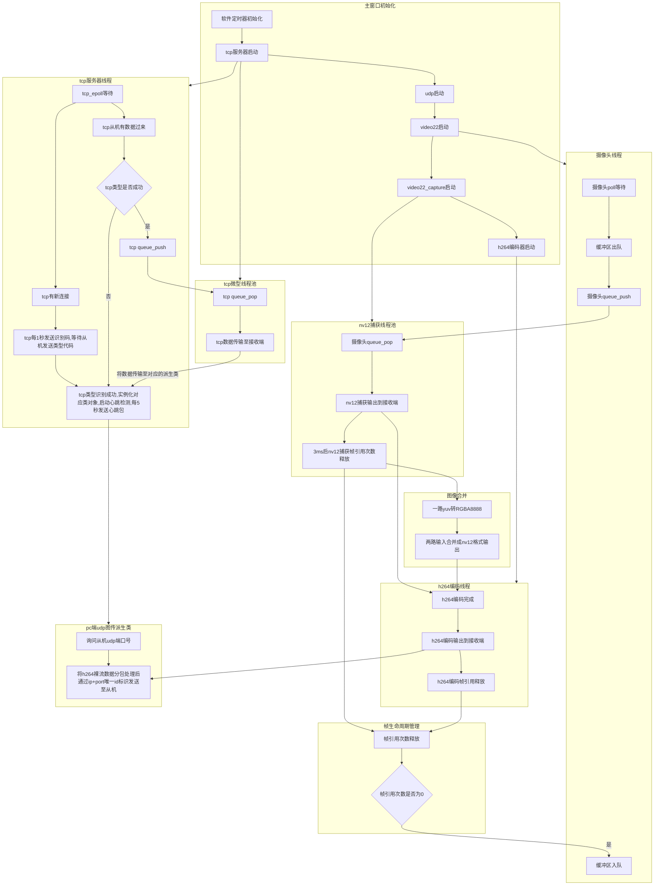

# rk3562_camera
RK3562运动相机开发

# 软件流程

# TCP通讯协议
## 通讯协议格式说明
| 字段 | 长度 | 值/范围 | 说明 |
|:-----|:-----|:--------|:-----|
| 帧头1 | 1 字节 | `0x5A` | 帧起始标志字节1 |
| 帧头2 | 1 字节 | `0xA5` | 帧起始标志字节2 |
| Addr | 2 字节 | `0x0000 - 0xFFFF` | 目标地址（16位无符号整数） |
| Len | 2 字节 | `0x0000 - 0xFFFF` | 数据域长度（16位无符号整数） |
| Data | Len 字节 | 任意数据 | 实际传输的有效数据内容 |

**完整帧结构示例**

| 帧头1 | 帧头2 | Addr (高字节) | Addr (低字节) | Len (高字节) | Len (低字节) | Data[0] | ... | Data[Len-1] |
|:-----:|:-----:|:------------:|:-------------:|:-----------:|:------------:|:-------:|:---:|:-----------:|
| 0x5A  | 0xA5  | ADDR_H       | ADDR_L        | LEN_H       | LEN_L        | DATA_0  | ... | DATA_N      |

**数据解析说明**

> **注意**：Len 字段表示 Data 域的实际字节长度，接收端应根据 Len 值读取相应数量的数据字节。

**示例**
- 发送地址 `0x1234`，数据长度 `5` 字节，数据内容为 `[0x01, 0x02, 0x03, 0x04, 0x05]`

| 0x5A | 0xA5 | 0x12 | 0x34 | 0x00 | 0x05 | 0x01 | 0x02 | 0x03 | 0x04 | 0x05 |

## 寄存器地址功能定义表
### 通用寄存器功能定义表

| 寄存器地址 (Addr) | 功能描述 | 数据长度 (Len) | 数据方向 | 说明 |
|:----------------:|:---------|:--------------:|:--------------:|:-----|
| `0xa000` | 主机访问从机类型 | 0 | 主→从 | 无 |
| `0xa0a0` | 主机发送心跳包/从机回复心跳包 | 0 |  主→从/ 从→主 |双向数据 |

### PC端图传类寄存器功能定义表

| 寄存器地址 (Addr) | 功能描述 | 数据长度 (Len) | 数据方向 | 说明 |
|:----------------:|:---------|:--------------:|:--------------:|:-----|
| `0x4000` | 主机访问udp端口号 | 0 |  主→从 |无 |
| `0x4000` | 从机回复udp端口号 | 2 |  从→主 |高位在前 |
