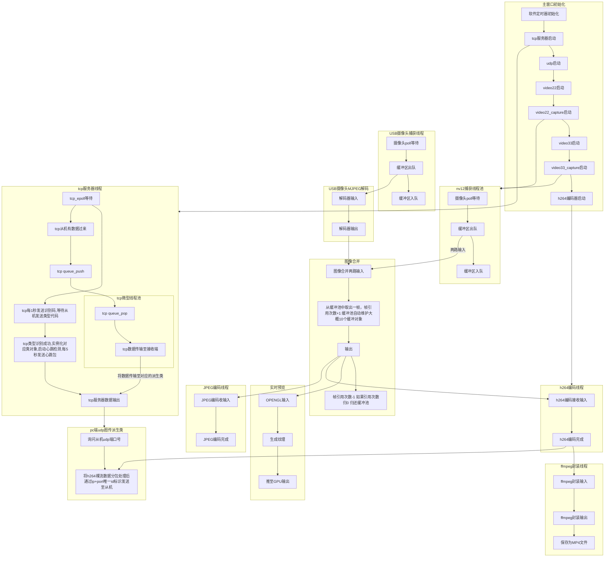

# rk3562_camera
RK3562运动相机开发

# 软件流程


# TCP通讯协议
## 通讯协议格式说明
| 字段 | 长度 | 值/范围 | 说明 |
|:-----|:-----|:--------|:-----|
| 帧头1 | 1 字节 | `0x5A` | 帧起始标志字节1 |
| 帧头2 | 1 字节 | `0xA5` | 帧起始标志字节2 |
| Addr | 2 字节 | `0x0000 - 0xFFFF` | 目标地址（16位无符号整数） |
| Len | 2 字节 | `0x00 - 0xFF` | 数据域长度（16位无符号整数） |
| Data | Len 字节 | 任意数据 | 实际传输的有效数据内容 |

**完整帧结构示例**

| 帧头1 | 帧头2 | Addr (高字节) | Addr (低字节) | Len  | Data[0] | ... | Data[Len-1] |
|:-----:|:-----:|:------------:|:-------------:|:-----------:|:-------:|:---:|:-----------:|
| 0x5A  | 0xA5  | ADDR_H       | ADDR_L        | LEN       | DATA_0  | ... | DATA_N      |

**数据解析说明**

> **注意**：Len 字段表示 Data 域的实际字节长度，接收端应根据 Len 值读取相应数量的数据字节。

**示例**
- 发送地址 `0x1234`，数据长度 `5` 字节，数据内容为 `[0x01, 0x02, 0x03, 0x04, 0x05]`

| 0x5A | 0xA5 | 0x12 | 0x34 | 0x05 | 0x01 | 0x02 | 0x03 | 0x04 | 0x05 |

## 寄存器地址功能定义表
### 通用寄存器功能定义表

| 寄存器地址 (Addr) | 功能描述 | 数据长度 (Len) | 数据方向 | 说明 |
|:----------------:|:---------|:--------------:|:--------------:|:-----|
| `0xa000` | 主机访问从机类型 | 0 | 主→从 | 无 |
| `0xa0a0` | 主机发送心跳包/从机回复心跳包 | 0 |  主→从/ 从→主 |双向数据 |

### PC端图传类寄存器功能定义表

| 寄存器地址 (Addr) | 功能描述 | 数据长度 (Len) | 数据方向 | 说明 |
|:----------------:|:---------|:--------------:|:--------------:|:-----|
| `0x4000` | 主机访问udp端口号 | 0 |  主→从 |无 |
| `0x4000` | 从机回复udp端口号 | 2 |  从→主 |高位在前 |

# PC端UDP图传协议

## 1. 协议简介

本协议是一个基于 UDP 的实时视频传输协议，专门用于传输 H.264 编码后的 NAL 单元。协议实现了自动分包与重组功能，通过避免 IP 分片来降低丢包影响，适用于实时视频图传场景。

## 2. 协议特性

- **避免 IP 分片**：单包负载上限 1400 字节，小于以太网 MTU，避免在网络层产生分片
- **自动分包重组**：支持将大的 NAL 单元拆分为多个 UDP 包发送，接收端自动重组
- **帧序号管理**：支持 32 位帧序号，便于丢包检测和乱序重组
- **结束包标识**：明确标识 NAL 单元的最后一个分片，便于接收端判断重组完成
- **紧凑头部设计**：固定 15 字节头部，开销小，适合实时传输

## 3. 协议常量定义

```cpp
// ─── 协议常量 ──────────────────────────────────────────────────────────────
static constexpr uint8_t  MAGIC_0        = 0x55;      // 魔数第1字节
static constexpr uint8_t  MAGIC_1        = 0xAA;      // 魔数第2字节
static constexpr uint8_t  PROTO_VERSION  = 1;         // 协议版本号
static constexpr uint8_t  PKT_TYPE_DATA  = 0x01;      // 数据包（非最后一个分片）
static constexpr uint8_t  PKT_TYPE_END   = 0x02;      // 结束包（最后一个分片）
static constexpr uint16_t MAX_UDP_PAYLOAD = 1400;     // 单包最大负载（避免IP分片）
```

## 4. 协议包头结构

### 4.1 字段说明

| 偏移 | 字段 | 长度 | 类型 | 说明 |
|------|------|------|------|------|
| 0 | magic | 2 | uint8_t[2] | 帧头魔数，固定为 `0x55 0xAA`，用于同步 |
| 2 | version | 1 | uint8_t | 协议版本号，当前为 `1` |
| 3 | frame_id | 4 | uint32_t | 帧序号，大端序，单调递增 |
| 7 | pkt_type | 1 | uint8_t | 包类型：`0x01`=数据包，`0x02`=结束包 |
| 8 | frag_index | 2 | uint16_t | 当前分片索引（从 1 开始），大端序 |
| 10 | frag_total | 2 | uint16_t | NAL 单元总分片数，大端序 |
| 12 | nalu_type | 1 | uint8_t | H.264 NAL 单元类型（参考 H.264 标准） |
| 13 | payload_len | 2 | uint16_t | 负载数据长度（字节），大端序 |

**头部总长度：15 字节**

### 4.2 内存布局（按字节偏移）

| 字节偏移 | 0 | 1 | 2 | 3 | 4 | 5 | 6 | 7 | 8 | 9 | 10 | 11 | 12 | 13 | 14 |
|----------|---|---|---|---|---|---|---|---|---|---|----|----|----|----|----|
| 字段 | magic_0 | magic_1 | version | frame_id (高8位) | frame_id | frame_id | frame_id (低8位) | pkt_type | frag_index (高8位) | frag_index (低8位) | frag_total (高8位) | frag_total (低8位) | nalu_type | payload_len (高8位) | payload_len (低8位) |

### 4.3 完整包结构

```
+------------------+---------------------------+
| 协议头 (15 字节)  | 负载数据 (payload_len 字节) |
+------------------+---------------------------+
```

> **注意**：所有多字节整数均采用**网络字节序（大端序）**传输。

## 5. 分包与重组机制

### 5.1 发送端分包流程

```
输入：NAL 单元数据（长度 N）
输出：多个 UDP 数据包

算法：
1. 计算总分片数 total = ceil(N / MAX_UDP_PAYLOAD)
2. 循环 i = 0 到 total-1：
   - 计算当前分片长度 len = min(MAX_UDP_PAYLOAD, N - i * MAX_UDP_PAYLOAD)
   - 确定包类型 type = (i == total-1) ? PKT_TYPE_END : PKT_TYPE_DATA
   - 分片索引 index = i + 1
   - 构造包头（所有字段填充正确值）
   - 发送 UDP 包（包头 + 分片数据）
```

### 5.2 接收端重组流程

```
输入：UDP 数据包
输出：完整的 NAL 单元

算法：
1. 解析包头，校验魔数和版本
2. 使用 (frame_id, nalu_type) 作为键查找重组缓存
3. 将负载数据存入对应 frag_index 位置
4. 如果 pkt_type == PKT_TYPE_END：
   - 检查所有分片（1 到 frag_total）是否都已收到
   - 若完整，则按顺序拼接所有分片，输出完整 NAL 单元
   - 清理该 NAL 的重组缓存
5. 如果超时未收齐，丢弃该 NAL 并清理缓存
```

### 5.3 分包示例

假设 MAX_UDP_PAYLOAD = 1400，NAL 单元大小 = 3500 字节：

| 分片序号 | 包类型 | 负载长度 | 说明 |
|----------|--------|----------|------|
| 1 | PKT_TYPE_DATA | 1400 | 第一个分片 |
| 2 | PKT_TYPE_DATA | 1400 | 第二个分片 |
| 3 | PKT_TYPE_END | 700 | 最后一个分片（结束包） |

