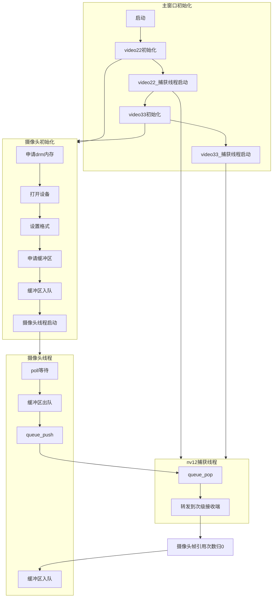

# rk3562_camera
RK3562运动相机开发

# 软件流程

```mermaid
flowchart TD
	
	subgraph 主窗口初始化
		start[启动] --> video22初始化 --> video22_捕获线程启动 --> video33初始化[video33初始化] --> video33_捕获线程启动
	end

	video22初始化 --> 摄像头初始化
	video33初始化 --> 摄像头初始化
	video22_捕获线程启动 --> nv12捕获线程
	video33_捕获线程启动 --> nv12捕获线程

	subgraph 摄像头初始化 [摄像头初始化]
		申请drm内存 --> 打开设备 --> 设置格式 --> 申请缓冲区 --> 初始化[缓冲区入队] --> 摄像头线程启动
	end

	subgraph 摄像头线程
		poll等待 --> 缓冲区出队 --> queue_push
		缓冲区入队[缓冲区入队]
	end

	摄像头线程启动 --> 摄像头线程

	subgraph nv12捕获线程
		queue_pop --> 转发到次级接收端
	end

	queue_push --> queue_pop
	转发到次级接收端 --> 次数归0[摄像头帧引用次数归0]  --> 缓冲区入队
```
