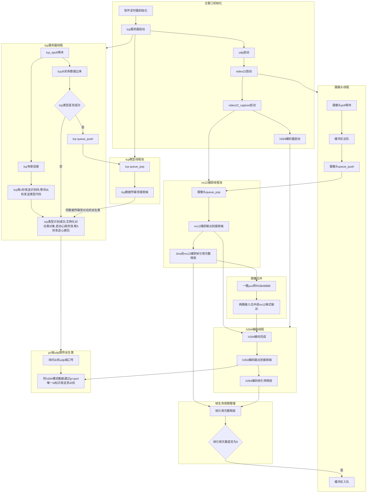

# rk3562_camera
RK3562运动相机开发

# 软件流程

```mermaid
flowchart TD
    subgraph 主窗口初始化
        direction TD
        软件定时器初始化-->tcp服务器启动
        tcp服务器启动-->udp启动
        udp启动-->video22启动
        video22启动-->video22_capture启动
        video22_capture启动-->h264编码器启动
    end

    subgraph 摄像头线程
        direction TD
        摄像头poll等待-->缓冲区出队
        缓冲区出队-->摄像头queue_push

        缓冲区入队
    end
    video22启动-->摄像头线程

    subgraph nv12捕获线程池
        摄像头queue_push-->摄像头queue_pop
		摄像头queue_pop --> nv12捕获输出到接收端
        nv12捕获输出到接收端-->3ms后nv12捕获帧引用次数释放
	end
    video22_capture启动-->nv12捕获线程池

    subgraph h264编码线程
        direction TD
        nv12捕获输出到接收端-->h264编码完成
        h264编码完成-->h264编码输出到接收端
        h264编码输出到接收端-->h264编码帧引用释放
    end
    h264编码器启动-->h264编码线程

    subgraph 帧生命周期管理
        direction TD
        3ms后nv12捕获帧引用次数释放-->帧引用次数释放
        h264编码帧引用释放-->帧引用次数释放
        帧引用次数释放-->帧引用次数是否为0{帧引用次数是否为0}
        帧引用次数是否为0-->|是| 缓冲区入队
    end

    subgraph tcp微型线程池
        direction TD
		tcp_queue_pop[tcp queue_pop]-->tcp数据传输至接收端
	end

    subgraph tcp服务器线程
        direction TD
        tcp_epoll等待-->tcp有新连接
        tcp有新连接-->tcp识别类型[tcp每1秒发送识别码,等待从机发送类型代码]
        tcp识别类型-->tcp识别成功[tcp类型识别成功,实例化对应类对象,启动心跳检测,每5秒发送心跳包]

        tcp_epoll等待-->tcp从机有数据过来
        tcp从机有数据过来-->tcp类型是否成功{tcp类型是否成功}
        tcp类型是否成功-->|是| tcp_queue_push[tcp queue_push]
        tcp类型是否成功-->|否| tcp识别成功
    end
    tcp_queue_push-->tcp_queue_pop
    tcp数据传输至接收端-->|将数据传输至对应的派生类|tcp识别成功
    tcp服务器启动-->tcp服务器线程
    tcp服务器启动-->tcp微型线程池

    subgraph pc端udp图传派生类
        direction TD
        pc端udp图传发送询问端口号[询问从机udp端口号]-->pc端udp图传h264裸流发送[将h264裸流数据通过ip+port唯一id标识发送至从机]
    end
    tcp识别成功-->pc端udp图传派生类
    h264编码输出到接收端-->pc端udp图传h264裸流发送

	subgraph 图像合并
        direction TD
        图像合并rga转一路输入格式[一路yuv转RGBA8888]-->图像合并rga合并[两路输入合并成nv12格式输出]
    end
    3ms后nv12捕获帧引用次数释放-->图像合并rga转一路输入格式
    图像合并rga合并-->h264编码完成
```
