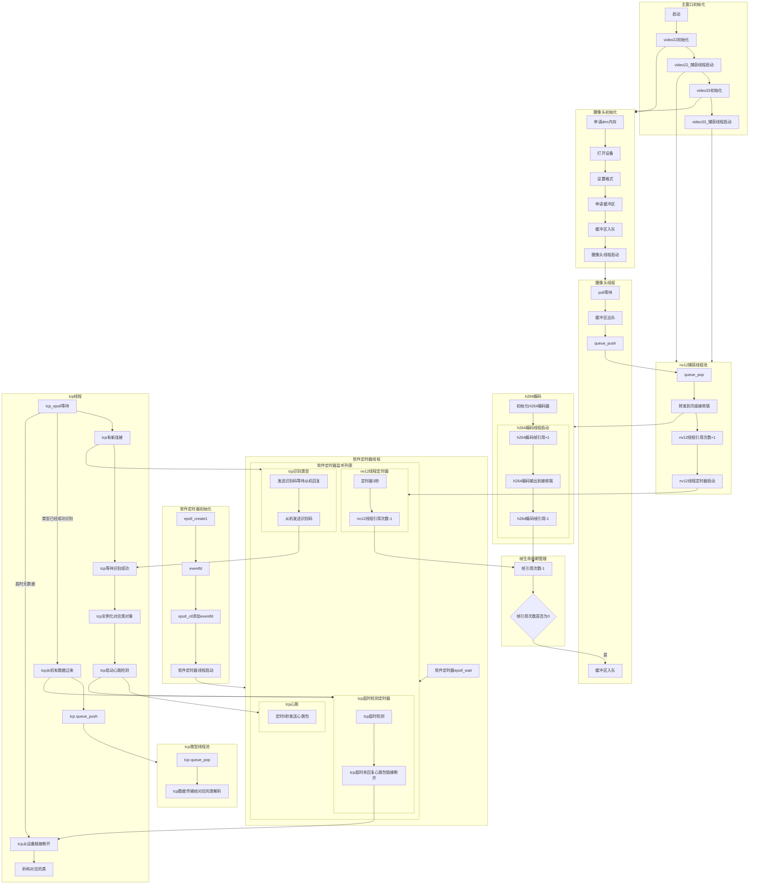

# rk3562_camera
RK3562运动相机开发

# 软件流程

```mermaid
flowchart TD
	
	subgraph 主窗口初始化
		start[启动] --> video22初始化 --> video22_捕获线程启动 --> video33初始化[video33初始化] --> video33_捕获线程启动
	end

	video22初始化 --> 摄像头初始化
	video33初始化 --> 摄像头初始化
	video22_捕获线程启动 --> nv12捕获线程池
	video33_捕获线程启动 --> nv12捕获线程池

	subgraph 摄像头初始化 [摄像头初始化]
		申请drm内存 --> 打开设备 --> 设置格式 --> 申请缓冲区 --> 初始化[缓冲区入队] --> 摄像头线程启动
	end

	subgraph 摄像头线程
		poll等待 --> 缓冲区出队 --> queue_push
		缓冲区入队[缓冲区入队]
	end

	摄像头线程启动 --> 摄像头线程

	subgraph nv12捕获线程池
		queue_pop --> 转发到次级接收端
        转发到次级接收端-->nv12线程引用次数+1
        nv12线程引用次数+1-->nv12线程定时器启动
	end

	queue_push --> queue_pop
	

    subgraph h264编码
        direction TD
        初始化H264编码器-->h264编码线程启动

        subgraph h264编码线程启动
            direction TD
            h264编码帧引用+1-->h264编码输出到接收端
            h264编码输出到接收端-->h264编码帧引用-1
        end
    end

    转发到次级接收端-->h264编码
    nv12线程定时器启动-->nv12线程定时器
    nv12线程引用次数-1-->帧引用次数-1
    h264编码帧引用-1-->帧引用次数-1

    subgraph 帧生命周期管理
        direction TD
        帧引用次数-1-->帧引用次数是否为0{帧引用次数是否为0}
        帧引用次数是否为0-->|是| 缓冲区入队
    end


	subgraph 软件定时器监听列表
        direction TD

        subgraph nv12线程定时器
            direction TD
            nv12线程定时器3秒[定时器3秒]-->nv12线程引用次数-1
        end

        subgraph tcp识别类型
            direction TD
            发送识别码等待从机回复-->从机发送识别码
        end

        subgraph tcp心跳
            定时5秒发送心跳包
        end

        subgraph tcp超时检测定时器
            direction TD
            tcp超时检测-->tcp链接超时[tcp超时未回复心跳包链接断开]
        end
    end

    subgraph 软件定时器线程
        direction TD
        软件定时器epoll_wait-->软件定时器监听列表
    end

    subgraph 软件定时器初始化
        direction TD
        软件定时器epoll_create1[epoll_create1] --> 软件定时器eventfd[eventfd]
		软件定时器eventfd[eventfd]-->添加eventfd到epoll[epoll_ctl添加eventfd]
		添加eventfd到epoll[epoll_ctl添加eventfd]-->软件定时器线程启动
    end

    软件定时器线程启动-->软件定时器线程
	
	subgraph tcp微型线程池
        direction TD
		tcp_queue_pop[tcp queue_pop]-->tcp数据传输给对应的类解析
	end
	
    tcp_queue_push-->tcp微型线程池

    subgraph tcp线程
        tcp_epoll等待
        tcp有新连接-->tcp识别类型
        tcp有新连接-->tcp等待识别成功
        从机发送识别码-->tcp等待识别成功
        tcp等待识别成功-->tcp实例化对应类对象
        tcp实例化对应类对象-->tcp启动心跳检测
        tcp启动心跳检测-->tcp心跳
        tcp启动心跳检测-->tcp超时检测定时器

        tcp从机有数据过来-->tcp_queue_push[tcp queue_push]
        tcp从机有数据过来-->tcp超时检测定时器

        tcp从设备链接断开-->析构对应的类
        tcp链接超时-->tcp从设备链接断开

        tcp_epoll等待-->tcp有新连接
        tcp_epoll等待-->|类型已经成功识别| tcp从机有数据过来
        tcp_epoll等待-->|超时无数据| tcp从设备链接断开
    end
```
