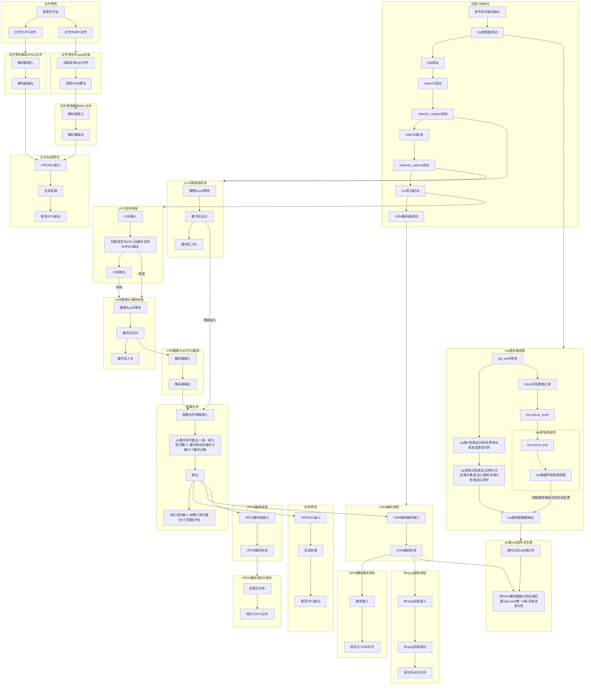

# RK3562 运动相机开发

[](LICENSE)
[]()

RK3562 运动相机项目是基于瑞芯微 RK3562 平台的多媒体相机开发方案，支持多路视频捕获、实时编码、网络传输和本地存储。

## 📋 项目概述

- **硬件平台**: Rockchip RK3562
- **主要语言**: C++
- **许可证**: Apache 2.0

## ✨ 主要功能

### 视频捕获与处理

- 支持两路 V4L2 本地摄像头捕获（NV12 格式）
- USB 摄像头即插即用支持（MJPEG 解码）
- 动态 USB 设备检测与管理
- 实时图像合并与缓冲管理

### 媒体编码

- **H.264 编码**: 实时硬件视频编码，输出裸流和 MP4 容器
- **H.264 解码**: 硬件加速解码，支持实时视频播放
- **JPEG 编码**: 静态图片拍照功能
- **MJPEG 解码**: USB 摄像头 MJPEG 流解码

### 网络传输

- **TCP 通讯**: 主从设备控制协议
- **UDP 图传**: H.264 NAL 单元分包传输协议
- 自动分包重组机制
- 心跳检测与设备管理

### 事件系统

- **事件总线 (EventBus)**: 发布-订阅模式，支持多主题事件通信
- **事件设备接口 (EventDevice)**: 统一的事件处理接口
- 线程安全的事件处理和分发机制

### 配置管理

- **JSON 配置封装 (JsonWrapper)**: 支持多层级 JSON 数据的读写
- 线程安全的 JSON 操作
- 灵活的数据类型转换

### 渲染与预览

- OpenGL 实时预览渲染
- DMA 缓冲区优化显示
- 文件预览功能（支持 JPG 和 MP4）

### 存储管理

- 本地文件系统支持
- H.264 裸流文件保存
- MP4 容器封装

## 🏗️ 系统架构

### 初始化流程

```
主窗口初始化
  ├─ 软件定时器
  ├─ TCP 服务器
  ├─ UDP 传输
  ├─ 视频捕获（video22/video33）
  ├─ USB 监控
  ├─ H.264 编码器
  ├─ H.264 解码器
  ├─ 事件总线
  └─ 配置管理
```

### 软件流程



### 数据流

1. **视频捕获**: 两路本地摄像头 (NV12) + USB 摄像头 (MJPEG) → 缓冲池
2. **图像合并**: 多路输入 → 单路合并输出
3. **编码处理**:
   - H.264 编码 → 保存为 .h264 文件 → MP4 封装
   - JPEG 编码 → 保存为 JPG 文件
4. **解码处理**:
   - H.264 解码 → 硬件加速 → 实时渲染显示
5. **网络传输**: H.264 数据 → UDP 分包 → 网络传输
6. **渲染显示**: 合并后的图像 → OpenGL 纹理 → 实时预览
7. **事件处理**: 系统事件 → EventBus → 订阅者回调

详细流程图请参考下方 **软件流程** 部分。

## 🔌 关键组件

### 视频处理

- `v4l2camera` - V4L2 摄像头基类
- `v4l2_nv12_capture` - NV12 格式视频捕获
- `v4l2_usb_camera` - USB 摄像头驱动
- `uvc_monitor` - USB 设备热插拔监控
- `videomerge` - 多路图像合并
- `DmaBufRenderer` - DMA 缓冲渲染

### 编码与解码

- `h264_encoder` - H.264 硬件编码
- `H264_Decoder` - H.264 硬件解码
- `mjpeg_decoder` - MJPEG 解码
- `mjpeg_encoder` - MJPEG 编码

### 网络通讯

- `tcp_server` - TCP 主服务器
- `tcp_device` - TCP 设备基类
- `pc_udp_imagetrans` - PC 端 UDP 图传协议实现
- `udpsocket` - UDP 套接字封装
- `udpnalu` - NAL 单元分包传输

### 事件与配置系统

- `EventBus` - 事件总线，支持发布-订阅模式
- `EventDevice` - 事件设备接口，统一的事件处理接口
- `JsonWrapper` - JSON 配置数据封装，支持多层级读写
- `VideoNodeState` - 视频节点状态管理，原子引用计数

### 工具类

- `PoolBuffer` - 图像缓冲池管理
- `RingBuffer` - 环形缓冲区
- `ThreadSafeBoundedQueue` - 线程安全队列
- `safe_thread` - 线程安全管理
- `timermanager` - 定时器管理
- `epollevent` - epoll 事件处理

## 📡 通讯协议

### TCP 协议格式
1. **TCP 协议格式**

| 字段  | 长度  | 值/范围 | 说明  |
| --- | --- | --- | --- |
| 帧头1 | 1 字节 | `0x5A` | 帧起始标志字节1 |
| 帧头2 | 1 字节 | `0xA5` | 帧起始标志字节2 |
| Addr | 2 字节 | `0x0000 - 0xFFFF` | 目标地址（16位无符号整数） |
| Len | 2 字节 | `0x00 - 0xFF` | 数据域长度（16位无符号整数） |
| Data | Len 字节 | 任意数据 | 实际传输的有效数据内容 |

**完整帧结构示例**

| 帧头1 | 帧头2 | Addr (高字节) | Addr (低字节) | Len | Data[0] | ... | Data[Len-1] |
| --- | --- | --- | --- | --- | --- | --- | --- |
| 0x5A | 0xA5 | ADDR_H | ADDR_L | LEN | DATA_0 | ... | DATA_N |

**数据解析说明**

> **注意**：Len 字段表示 Data 域的实际字节长度，接收端应根据 Len 值读取相应数量的数据字节。

**示例**

- 发送地址 `0x1234`，数据长度 `5` 字节，数据内容为 `[0x01, 0x02, 0x03, 0x04, 0x05]`

| 0x5A | 0xA5 | 0x12 | 0x34 | 0x05 | 0x01 | 0x02 | 0x03 | 0x04 | 0x05 |

2. **寄存器地址表**

2.1 通用寄存器

| 寄存器地址 (Addr) | 功能描述 | 数据长度 (Len) | 数据方向 | 说明  |
| --- | --- | --- | --- | --- |
| `0xa000` | 主机访问从机类型 | 0   | 主→从 | 无   |
| `0xa0a0` | 主机发送心跳包/从机回复心跳包 | 0   | 主→从/ 从→主 | 双向数据 |

2.2 PC端图传类寄存器

| 寄存器地址 (Addr) | 功能描述 | 数据长度 (Len) | 数据方向 | 说明  |
| --- | --- | --- | --- | --- |
| `0x4000` | 主机访问udp端口号 | 0   | 主→从 | 无   |
| `0x4000` | 从机回复udp端口号 | 2   | 从→主 | 高位在前 |

### PC端UDP图传

1. **协议简介**  
   本协议是一个基于 UDP 的实时视频传输协议，专门用于传输 H.264 编码后的 NAL 单元。协议实现了自动分包与重组功能，通过避免 IP 分片来降低丢包影响，适用于实时视频图传场景。

2. **协议特性**  
   - 避免 IP 分片：单包负载上限 1400 字节，小于以太网 MTU，避免在网络层产生分片  
   - 自动分包重组：支持将大的 NAL 单元拆分为多个 UDP 包发送，接收端自动重组  
   - 帧序号管理：支持 32 位帧序号，便于丢包检测和乱序重组  
   - 结束包标识：明确标识 NAL 单元的最后一个分片，便于接收端判断重组完成  
   - 紧凑头部设计：固定 15 字节头部，开销小，适合实时传输

3. **协议常量定义**  
   ```cpp
   static constexpr uint8_t  MAGIC_0        = 0x55;      // 魔数第1字节
   static constexpr uint8_t  MAGIC_1        = 0xAA;      // 魔数第2字节
   static constexpr uint8_t  PROTO_VERSION  = 1;         // 协议版本号
   static constexpr uint8_t  PKT_TYPE_DATA  = 0x01;      // 数据包（非最后一个分片）
   static constexpr uint8_t  PKT_TYPE_END   = 0x02;      // 结束包（最后一个分片）
   static constexpr uint16_t MAX_UDP_PAYLOAD = 1400;     // 单包最大负载（避免IP分片）
   ```

4. **协议包头结构**  
   4.1 字段说明  
   | 偏移 | 字段 | 长度 | 类型 | 说明 |
   | --- | --- | --- | --- | --- |
   | 0 | magic | 2 | uint8_t[2] | 帧头魔数，固定为 0x55 0xAA，用于同步 |
   | 2 | version | 1 | uint8_t | 协议版本号，当前为 1 |
   | 3 | frame_id | 4 | uint32_t | 帧序号，大端序，单调递增 |
   | 7 | pkt_type | 1 | uint8_t | 包类型：0x01=数据包，0x02=结束包 |
   | 8 | frag_index | 2 | uint16_t | 当前分片索引（从 1 开始），大端序 |
   | 10 | frag_total | 2 | uint16_t | NAL 单元总分片数，大端序 |
   | 12 | nalu_type | 1 | uint8_t | H.264 NAL 单元类型 |
   | 13 | payload_len | 2 | uint16_t | 负载数据长度（字节），大端序 |
   
   头部总长度：15 字节  
   
   4.2 内存布局（按字节偏移）  
   | 偏移 | 0 | 1 | 2 | 3 | 4 | 5 | 6 | 7 | 8 | 9 | 10 | 11 | 12 | 13 | 14 |
   | --- | --- | --- | --- | --- | --- | --- | --- | --- | --- | --- | --- | --- | --- | --- | --- |
   | 字段 | magic_0 | magic_1 | version | frame_id(高8位) | frame_id | frame_id | frame_id(低8位) | pkt_type | frag_index(高8位) | frag_index(低8位) | frag_total(高8位) | frag_total(低8位) | nalu_type | payload_len(高8位) | payload_len(低8位) |
   
   4.3 完整包结构  
   ```
   +------------------+---------------------------+
   | 协议头 (15 字节)  | 负载数据 (payload_len 字节) |
   +------------------+---------------------------+
   ```
   注意：所有多字节整数均采用网络字节序（大端序）传输。

5. **分包与重组机制**  
   5.1 发送端分包流程  
   输入：NAL 单元数据（长度 N）  
   输出：多个 UDP 数据包  
   算法：  
   1. 计算总分片数 total = ceil(N / MAX_UDP_PAYLOAD)  
   2. 循环 i = 0 到 total-1：  
      - 计算当前分片长度 len = min(MAX_UDP_PAYLOAD, N - i * MAX_UDP_PAYLOAD)  
      - 确定包类型 type = (i == total-1) ? PKT_TYPE_END : PKT_TYPE_DATA  
      - 分片索引 index = i + 1  
      - 构造包头（所有字段填充正确值）  
      - 发送 UDP 包（包头 + 分片数据）  

   5.2 接收端重组流程  
   输入：UDP 数据包  
   输出：完整的 NAL 单元  
   算法：  
   1. 解析包头，校验魔数和版本  
   2. 使用 (frame_id, nalu_type) 作为键查找重组缓存  
   3. 将负载数据存入对应 frag_index 位置  
   4. 如果 pkt_type == PKT_TYPE_END：  
      - 检查所有分片（1 到 frag_total）是否都已收到  
      - 若完整，则按顺序拼接所有分片，输出完整 NAL 单元  
      - 清理该 NAL 的重组缓存  
   5. 如果超时未收齐，丢弃该 NAL 并清理缓存  

   5.3 分包示例  
   假设 MAX_UDP_PAYLOAD = 1400，NAL 单元大小 = 3500 字节：  
   | 分片序号 | 包类型 | 负载长度 | 说明 |
   | --- | --- | --- | --- |
   | 1 | PKT_TYPE_DATA | 1400 | 第一个分片 |
   | 2 | PKT_TYPE_DATA | 1400 | 第二个分片 |
   | 3 | PKT_TYPE_END | 700 | 最后一个分片（结束包） |

## JSON 封装

JsonWrapper 提供了线程安全的 JSON 数据读写接口，支持多层级结构的访问。

**使用示例**

```cpp
#include "JsonWrapper.h"

JsonWrapper js;

// 写入数据
js.import("device.camera.width", 1920);
js.import("device.camera.height", 1080);
js.import("device.camera.format", "NV12");

// 读取数据
int width = 0;
if (js.get("device.camera.width", width)) {
    std::cout << "width = " << width << std::endl;
}

// 序列化为 JSON 字符串
std::string json_str = js.dump(4);  // 缩进 4 个空格
```

## 📁 项目结构

```
.
├── 视频捕获        v4l2camera.{h,cpp}, v4l2_nv12_capture.{h,cpp}, v4l2_usb_camera.{h,cpp}
├── 编码与解码      h264_encoder.{h,cpp}, h264_decoder.{h,cpp}, mjpeg_*.{h,cpp}
├── 网络通讯        tcp_*.{h,cpp}, udp*.{h,cpp}, pc_udp_imagetrans.{h,cpp}
├── 事件系统        EventBus.{h,cpp}, event_device.{h,cpp}, qteventdevice.{h,cpp}
├── 配置管理        JsonWrapper.{h,cpp,inl}, json.hpp
├── 状态管理        VideoNodeState.h
├── 渲染显示        DmaBufRenderer.{h,cpp}, ImageDisplay.{h,cpp}
├── 工具类          PoolBuffer.h, RingBuffer.h, safe_thread.{h,cpp}, timermanager.{h,cpp}
├── 主程序          main.cpp, mainwindow.{h,cpp}
├── 其他            LICENSE, .gitignore
└── README.md       本文件
```
